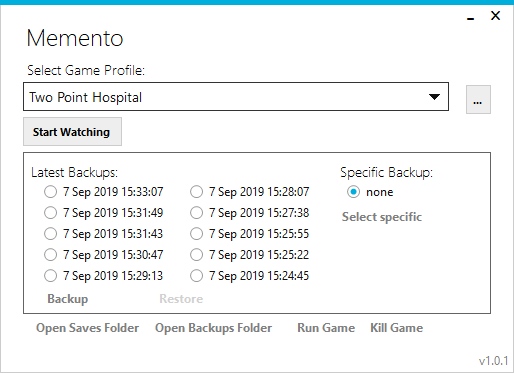

# Memento



This is a simple tool for save scumming for Windows, initial version written in an evening. Build it on Windows 11 with .NET Core 8.0

## Support

The program does not attempt to recover in case if unexpected scenario, for example, path permissions are not checked, so if a file or folder is inaccessible the program will crash. 
If it deposits a file named `unhandled-*.log ` in the same folder where the executable file is, providing it to me may help to track down the problem. I'll try to fix major issues as they are found, if/when I have time.

## Usage

Usage is straight forward:

- Create a new profile for a game
- Specify the game save folder and the game executable and a few options (below)
- Select "Start watching" for the program to start monitoring the save folder and making copies whenever there is no changes for 5 seconds after the last change
- Or press "Backup" / "Restore" to backup / restore as a one off
- Right-clicking on a save will allow to rename or delete it
- Clean up old backups by clicking "Open Backups Folder" and browsing the folder structure, it's pretty self-explanatory

That's about it. The program does not prune old saves, so if unchecked, it can get out of control soon - please do it manually

Please make sure that when you are restoring, the game is not running, most games are not programmed to withstand save changes on the fly.

## Options

- **Kill/restart game during restore** - If checked, when you press "Restore", Memento will attempt to kill the game process, do the file restoration and re-launch the game process again
- **Do not warn when restoring** - In most cases trying to restore while the game is running won't produce desired results, so Memento warns you in this situation. If checked, the warning is not generated
- **Clean up save folder before restoring** - Usually during restore process the game save back up is simply copied over the saves folder. This will leave any files that was there before restoring and is not part of the backup intact. Most of the time this does not matter. In rare case the game may behave differently in the presence of a file it does not expect. Check this options to delete the save folder completely before restoring, so after restoring it exactly matches the backup
- **Backup before restoring** - If checked, when you press "Restore" Memento also does a back up before it does the restore
- **Backup on start watching** - If checked, when you press "Start Watching" Memento takes a backup immediatelly, even before a first change detected
- **Write log** - If checked Memento will write a debug log in a file. Press "Open Backups Folder" to see the log file
- **Show number of files backed up** - See Advanced Filtering below
- **Delete without confirmation** - do not ask for confirmation when deleting a backup
- **Minimum minutes between backups** - only affects automatic backups, when the watcher is on. Will not back up if there is a recent backup not older than given number of minutes. Specify `0` to disable.

## Advanced Filtering

You can click "Configure advanced filtering" when editing a game profile. You can configure the following settings there:

**Backup Filter** - Specify a .net [Regular Expressions](https://docs.microsoft.com/en-us/dotnet/standard/base-types/regular-expression-language-quick-reference) to select files to backup. The regular expression are matched against file paths relative to the Backup Folder. For example, if you only want to backup file `save` at the top level of the Backup folder, specify `^save$` here. If you want all the files with `.sav` extension, regardless of subfolder `.sav$` will work, etc. Leave this field empty to copy all files in the Backup Folder recursively.

When the Backup Filter option is specified, a couple of options above behave differently:

- *Clean up save folder before restoring* - instead of removing the entire backup subfolder, only the files matching the Backup Filter are removed.
- *Show number of files backed up* - this option can only be enabled if Backup Filter is specified. (Because otherwise Memento copies the entire folder and does not know individual files count). When enabled, after each backup a message will be displayed in the main Memento window, specifying the number of files included in the last backup. This can be helpful to see at a glance that your regular expression backups what you want. Of course, you can always press "Backup", "Open Backups Folder" and drill down to see what exactly was backed up.

**Watch Filter** - Can be used to fine tune a bit when the file change detection is triggered, to reduce the performance impact of rapidly changing files. Unfortunately the syntax of this filter does not allow regex, just basic operating system wildcards: `*` and `?`. See [filter](https://docs.microsoft.com/en-us/dotnet/api/system.io.filesystemwatcher.filter) for more details. When Memento receives a file change event, and backup filter (above) is specified, the file name in the even it matched against the backup filter. If the match does not occur, the event will not trigger a backup. Most of the time you can leave this field blank.

**Watch Subfolders** - if switched off, subfolders will not be watched for changes

## Cloud Sync

The application does not have a built in cloud sync, but you can sync the backups folder and `settings.json` using something lite Dropbox, or Google Drive or many other cloud sync providers.

When I started using it for playing on different computers, I noticed, that the installation and save paths could be different for the same game. When this happens Memento displays a error when you switch to a profile, that it cannot find the game executable or saves folder respectively. And if you change it the change would sync back, so it will now give a error on your first computer. To help with this in version 1.3.0 the installation and save paths are now saved per computer in `settings.json`, so when you get the error saying that they are missing, if you set them correctly it will save it for the current computer and won't affect the same settings for another one.

And yet, as I started playing more games on two devices it become annoying that I need to adjust the path on the second device for each single game. Because of this in version 1.6.0 I added auto-detection of those path. This auto-detection works by examining the paths from the other devices and mapping them to the current device based on a prefix map.

As of the moment of writing, the prefix map does not have an UI option. This is because a) I could not be bothered to implement it yet b) It is not clear where in the UI it should reside and what it would look like. Normally something like this would go into settings page, but this app does not have a setting page. And if I create one just for that, then where is the rest of settings one might ask.

After you update to the latest version load the program and change the currently selected game to trigger a `settings.json` update. Exit the program. In `settings.json` find the `PrefixMap` element, and substitute it with something like this:

```json
 "PrefixMap": {
    "MYDESKTOP": {
      "UserProfilePrefix": [
        "C:\\Users\\homeuser\\"
      ],
      "SteamPathPrefix": [
        "D:\\steam\\",
        "C:\\steam\\"
      ],
      "EpicPathPrefix": [
        "E:\\Program Files\\Epic Games\\"
      ]
    },
    "WORKLAPTOP": {
      "UserProfilePrefix": [
        "C:\\Users\\workuser\\"
      ],
      "SteamPathPrefix": [
        "D:\\HiddenSecertTotallyWorkRelated\\steam\\"
      ],
      "EpicPathPrefix": [
        "D:\\HiddenSecertTotallyWorkRelated\\Epic"
      ]
    }
  }
```

Under the `PrefixMap` there should be an object for each of the computers you sync your data across. The name of them should be what you see under `SavesFolderCollection` and `GameExecutableCollection` in `settings.json` for each of you game profiles, e.g. if you see there:


```json
      "SavesFolderCollection": {
        "MYDESKTOP": "C:\\Users\\andrewsav\\AppData\\LocalLow\\Eremite Games\\Against the Storm",
        "WORKLAPTOP": "C:\\Users\\admas$\\AppData\\LocalLow\\Eremite Games\\Against the Storm"
      },
      "GameExecutableCollection": {
        "MYDESKTOP": "E:\\Program Files\\Epic Games\\AgainstTheStorm\\Against the Storm.exe",
        "WORKLAPTOP": "D:\\Misc\\Epic\\AgainstTheStorm\\Against the Storm.exe"
      },
```

Then you know that `MYDESKTOP` and `WORKLAPTOP` are the names you are going to use. Under those Prefix Map objects, go prefix objects: the name of them are arbitrary, but should match across your computer objects, and the values of them are an array with possible path prefixes for that prefix.

In the example above on `MYDESKTOP` the steam games are installed on both disks `D` and `C`. Under  `D:\steam\` and  `C:\steam\` respectively. (*Note: in json `\` should be escaped by doubling it*), and on `WORKLAPTOP` steam games are located under `D:\HiddenSecertTotallyWorkRelated\steam\` (*Note: I do not endorse or support using your work laptop for work unrelated stuff, please check your employer policy on that*). So for the path detection to work I create a prefix in `PrefixMap` for each of the computers with the same name which does not matter, but in this case I chose descriptive `SteamPathPrefx` name. I create prefixes for other possible paths, such as Epic games installation path and user profile path under which saves are often written by games.

With this setup in place, next time I add a new game to Memento on `MYDESKTOP`, after this game is installed to `WORKLAPTOP` the path for it could be autodetected. The autodetection works by looking at the configured paths for other computers, seeing if those paths have prefixes listing in the `PrefixMap` and if yes, changing the path prefix to match the current computer. Autodetection could fail if there is not enough information to figure out the path, in which case you still can specify paths manually as before.

## Installation

Download latest version from [Releases](https://github.com/AndrewSav/Memento/releases). There are two version .NET Core self-contained, which is supposed to run without dependencies, and a smaller one that relies on .NET Core SDK/runtime present on your PC. 

Unzip the archive and put the content to a folder and run.

## Building

You can build in VS2022. You can use `build.ps1` to build the Release with .Net core SDK. You probably want to delete your `bin`/`obj` before the build so that the build output does not have irrelevant files you might have used during testing.

To create a release via GitHub actions update version in `Memento.csproj`and create/push a tag, e.g. `1.2.3`

## Change Log

* 1.7.0
  * Enforce single instance, since multiple instances step on each other toes
* 1.6.5
  * Another UI scaling fix
  * Updated to .net 10
* 1.6.4
  * Updated dependecies
  * Small fixes for UI scaling
* 1.6.3
  * Updated dependecies
  * Attempted to improve UI so it does not require two click to do anything when the main window does not have focus
* 1.6.2
  * Fixed crash if path detection would run, but no prefix map was specified
  * Resolved slow downs with path detections on certain code paths
* 1.6.1
  * GitHub Actions build process
* 1.6.0
  * Updated dependencies
  * Add installed and save path detection when playing the same game on a second computer, and syncing via cloud sync. See Cloud Sync section above
* 1.5.0
  * Added ability to clone Profiles, e.g. when you want to track different characters separately for the same game
* 1.4.1
  * Added `Watch Subfolders` setting
  * Added `Minimum minutes between backups` setting
  * Remove warp based builds as .net can now do this natively
  * Fixed an issue with `Show number of files backed up` option not respected
  * Watcher notifications that do not match backup filter are now ignored
  * Embbed PDB into executable
* 1.4.0
  * Upgraded to .net 8
  * Fixed issue with deleting saves on Google Drive
* 1.3.0

  * Upgraded to .net SDK 6.0.101
  * Paths to the game executable and the save folder are now saved per PC making it easier to sync the backups with the likes of Dropbox and Google Drive
* 1.2.0

  * Upgraded to .net SDK 6.0.100
  * Added an confirmation dialog when deleting a backup
  * Added help links to advanced filtering window
* 1.1.0

  * Upgraded to .net SDK 5.0.400
  * When "Kill/restart game during restore" is enambled attempt to wait for process to finish after killing it
  * Now "Kill/restart game during restore" option actually attempt to restart the game after restore
  * Updated dependencies
  * Added an option for File Watcher [filter](https://docs.microsoft.com/en-us/dotnet/api/system.io.filesystemwatcher.filter)
  * Added an option to filter which files to backup using [Regular Expressions](https://docs.microsoft.com/en-us/dotnet/standard/base-types/regular-expression-language-quick-reference)
  * Minor code clean up
  * Fixed an issue Where "Delete" backup would not delete the parent folders if it's the last backup we are deleting in the parent folder, which interfered with Radio Buttons display logic causing some backups not to be displayed
* 1.0.6

  * Upgraded to .net 5
  * Upgraded dependencies
* 1.0.5

  * Fixed to work with the new Windows Forms Designer for .NET Core
  * Minor fix in the build script
  * Added "Deleting old save before restoring" option (use with care, if used on Windows build before 1903, it can cause intermittent deletion lock issues)
  * Updated dependencies
* 1.0.4

  * Added ability to rename saves
  * Added ability to delete saves from the application itself
  * Fixed a bug, when after renaming a profile, the application did not know how to find old saves
  * A minor fix for MetroFramework
* 1.0.3

  * Removed maximise button on the Edit form
  * Moved up Edit form button to align better with the drop down
  * Fixed version link not working
  * Updated .net core sdk to the lastest
  * Worked around a race condition in the build script, that caused a missing icon in the executable
* 1.0.2

  * Ported to .Net Core. 
  * Fixed an issue with [Use Unicode UTF-8 for worldwide language support](https://stackoverflow.com/questions/56419639/what-does-beta-use-unicode-utf-8-for-worldwide-language-support-actually-do) option.


## Attributions

* Icon made by [bqlqn](https://www.flaticon.com/authors/bqlqn) from [www.flaticon.com](https://www.flaticon.com)
* MetroFramework - https://thielj.github.io/MetroFramework/
* Newtonsoft Json.NET - https://www.newtonsoft.com/json
* Serilog - https://serilog.net/
* Serilog.Sinks.File -  https://github.com/serilog/serilog-sinks-file
* ReactiveX - http://reactivex.io/
